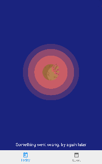

# Nasa Astronomy picture of the day

Nasa APOD api consumer Flutter application

## Screenshot

| Loading | Loading Error | Detail | WIP |
|---------|---------------|--------|-----|
| |  |  |  |

## Credits

Icons designed by [Freepik](https://www.flaticon.es/autores/freepik) from [Flaticon](https://www.flaticon.es/)

